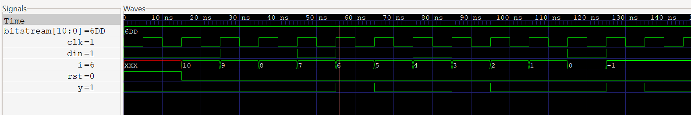

# Problem 1 — Sequence Detector (1101) - Mealy FSM

This repository implements a **Mealy Finite State Machine (FSM)** to detect the sequence **1101** in a serial input stream, with support for **overlapping sequences**.  
When the sequence is detected, the output `y` generates a **single-cycle pulse**.

---

## Overview

- Monitors a serial input stream (`din`).
- Outputs `y = 1` for **one clock cycle** when sequence `1101` is detected.
- Supports **overlaps**: a new sequence can begin before the previous one ends.

---

## State Diagram


---

## FSM States

- **Init (00):** Initial state, no match detected
- **One (01):** Detected a single `'1'`
- **Two (10):** Detected `"11"`
- **Three (11):** Detected `"110"`

---

## State Transition Table

| Current State | Input | Next State | Output (y) |
| ------------- | ----- | ---------- | ---------- |
| Init (00)     | 0     | Init       | 0          |
| Init (00)     | 1     | One        | 0          |
| One (01)      | 0     | Init       | 0          |
| One (01)      | 1     | Two        | 0          |
| Two (10)      | 0     | Three      | 0          |
| Two (10)      | 1     | Two        | 0          |
| Three (11)    | 0     | Init       | 0          |
| Three (11)    | 1     | One        | 1          |

---

## Files

- `seq_detect_mealy.v` — Verilog implementation of the FSM
- `tb_seq_detect_mealy.v` — Testbench for simulation

---

## Run Simulation

```bash
# Compile
iverilog -g2012 -o seqdet_sim seq_detect_mealy.v tb_seq_detect_mealy.v

# Run
vvp sim

# View waveform
gtkwave dump.vcd
```

---

## Expected Behavior

For input bitstream:

```
11011011101
```

- Detection occurs at: **45ns, 75ns, 115ns**
- Output `y` produces **3 single-cycle pulses**

---

## Results

- Correctly detects overlapping `1101` sequences
- `y` generates a **single-cycle pulse** on detection
- Verified in **GTKWave**


