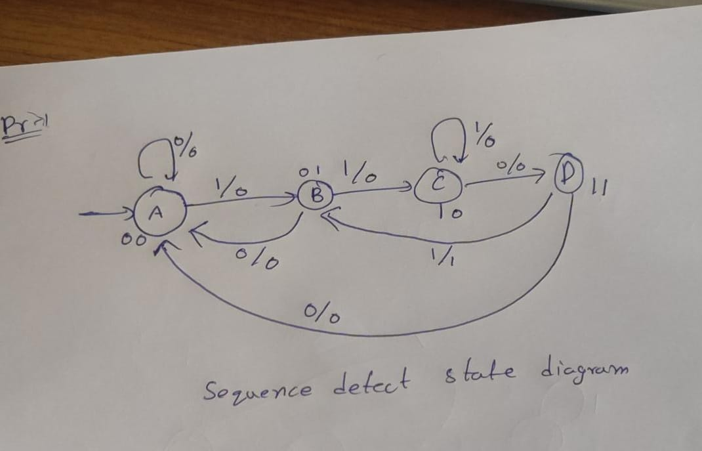

### Problem 1 — Sequence Detector

```markdown
# Sequence Detector (1101) - Mealy FSM

This design implements a Mealy FSM that detects the sequence **1101** in a serial input stream with overlap handling.  
On detecting the pattern, the output `y` generates a **single-cycle pulse**.

---

## State Diagram



---

## States

- `init` (00): No match yet
- `one` (01): Detected '1'
- `two` (10): Detected "11"
- `three` (11): Detected "110"

**Transitions**
```

init --1--> one --1--> two --0--> three --1/y=1--> one

````

---

## Files
- `seq_detect_mealy.v` – FSM implementation
- `tb_seq_detect_mealy.v` – Testbench

---

## Run Simulation
```bash
iverilog -g2012 -o seqdet_sim seq_detect_mealy.v tb_seq_detect_mealy.v
vvp seqdet_sim
gtkwave dump.vcd
````

---

## Expected Behavior

Bitstream: `11011011101`

- Detection occurs at indices: 45ns, 75ns, 115ns
- `y=1` pulses exactly 3 times

---

## Results

- Correctly detects overlapping `1101`
- Single-cycle pulse on detection
- Verified with waveform below


