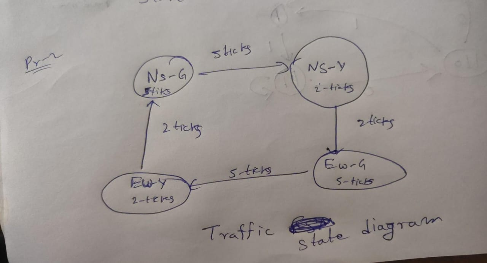
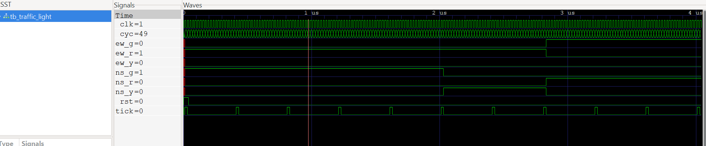

# Problem 2 — Traffic Light Controller FSM

This repository implements a **Finite State Machine (FSM)** to control traffic lights at a two-way intersection (North-South and East-West).  
The FSM cycles through **Green → Yellow → Red** phases with fixed durations for each direction.

---

## Overview
- Controls two directions: **North-South (NS)** and **East-West (EW)**.  
- Each direction cycles through: **Green → Yellow → Red**.  
- Timing is controlled by a counter using an external `tick` signal.  
- Ensures **mutual exclusion**: both directions cannot be green simultaneously.  

---

## State Diagram


---

## FSM States
- **NS_GREEN (00):** North-South green, East-West red  
- **NS_YELLOW (01):** North-South yellow, East-West red  
- **EW_GREEN (10):** East-West green, North-South red  
- **EW_YELLOW (11):** East-West yellow, North-South red  

---

## State Transition Table

| Current State | Condition     | Next State   |
|---------------|---------------|--------------|
| NS_GREEN      | after 5 ticks | NS_YELLOW    |
| NS_YELLOW     | after 2 ticks | EW_GREEN     |
| EW_GREEN      | after 5 ticks | EW_YELLOW    |
| EW_YELLOW     | after 2 ticks | NS_GREEN     |

---

## Files
- `traffic_light.v` — Verilog FSM implementation  
- `tb_traffic_light.v` — Testbench for simulation  

---

## Run Simulation

```bash
# Compile
iverilog -g2012 -o traffic_sim traffic_light.v tb_traffic_light.v

# Run
vvp traffic_sim

# View waveform
gtkwave traffic.vcd
```

---

## Expected Behavior

Traffic light sequence:

```
NS Green  → 5 ticks
NS Yellow → 2 ticks
EW Green  → 5 ticks
EW Yellow → 2 ticks
(repeats)
```

* NS and EW are never green at the same time  
* Sequence repeats indefinitely  

---

## Results

* Correct cycle sequence verified  
* No overlap of green signals  
* Timing confirmed in **GTKWave**  


