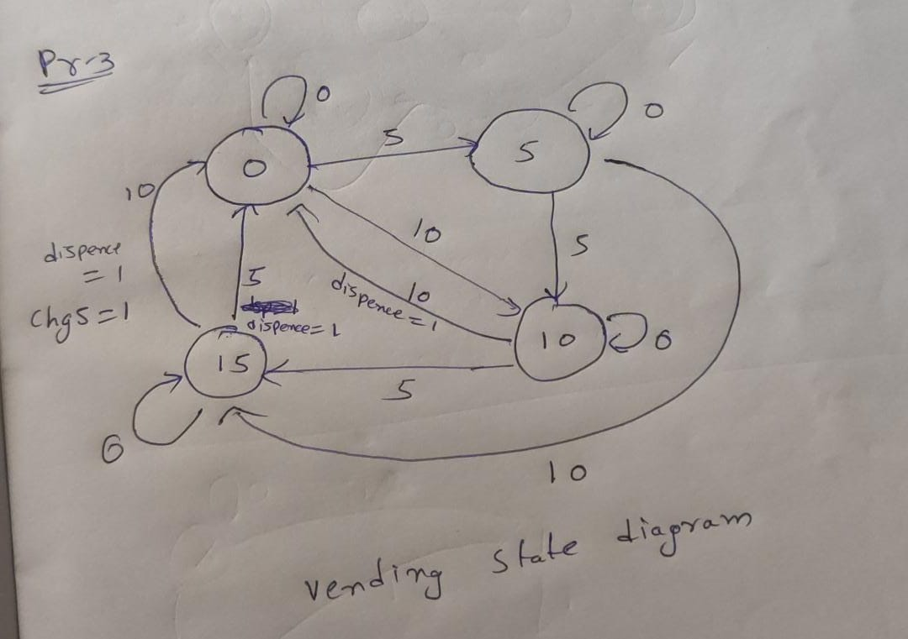
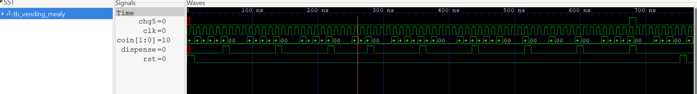

# Problem 3 — Vending Machine FSM (Mealy)

This repository implements a **Mealy Finite State Machine (FSM)** for a vending machine that accepts coins of denomination **5** and **10**.  
The machine dispenses a product when the total inserted amount reaches **20** or more, and returns change when necessary.

---

## Overview
- Product Price: **20 units**  
- Accepted Coins: **5 (coin=01)** and **10 (coin=10)**  
- Dispense: When total ≥ 20, output `dispense = 1` for **one cycle**  
- Change: If total = 25, output `chg5 = 1` for **one cycle**  
- Reset: Synchronous active-high reset  
- Ignores invalid coins (`coin=11`), treats `coin=00` as idle  

---

## State Diagram


---

## FSM States
- **Idle (00):** Total = 0  
- **Five (01):** Total = 5  
- **Ten (10):** Total = 10  
- **Fifteen (11):** Total = 15  

---

## State Transition Table

| Current State | Coin Input | Next State | Output (dispense, chg5) |
|---------------|------------|------------|--------------------------|
| Idle (00)     | 01         | Five       | 0,0 |
| Idle (00)     | 10         | Ten        | 0,0 |
| Five (01)     | 01         | Ten        | 0,0 |
| Five (01)     | 10         | Fifteen    | 0,0 |
| Ten (10)      | 01         | Fifteen    | 0,0 |
| Ten (10)      | 10         | Idle       | 1,0 |
| Fifteen (11)  | 01         | Idle       | 1,0 |
| Fifteen (11)  | 10         | Idle       | 1,1 |

---

## Files
- `vending_mealy.v` — FSM implementation  
- `tb_vending_mealy.v` — Testbench  

---

## Prerequisites
- **Icarus Verilog** — for compiling and simulating Verilog  
- **GTKWave** — for viewing waveforms  

Install on Ubuntu/Debian:
```bash
sudo apt-get install iverilog gtkwave
```

---

## Run Simulation

```bash
# Compile
iverilog -g2012 -o vending_sim vending_mealy.v tb_vending_mealy.v

# Run
vvp vending_sim

# View waveform
gtkwave tb_vending_mealy.vcd
```

---

## Expected Behavior

Example coin sequences:

```
5 + 5 + 10 = 20 → dispense=1, chg5=0
10 + 10 = 20    → dispense=1, chg5=0
15 + 10 = 25    → dispense=1, chg5=1
```

* Single-cycle pulses for `dispense` and `chg5`  
* FSM resets to Idle after each transaction  

---

## Results

* Correct product dispense on total ≥ 20  
* Correct change return for total = 25  
* Verified using **GTKWave**  


