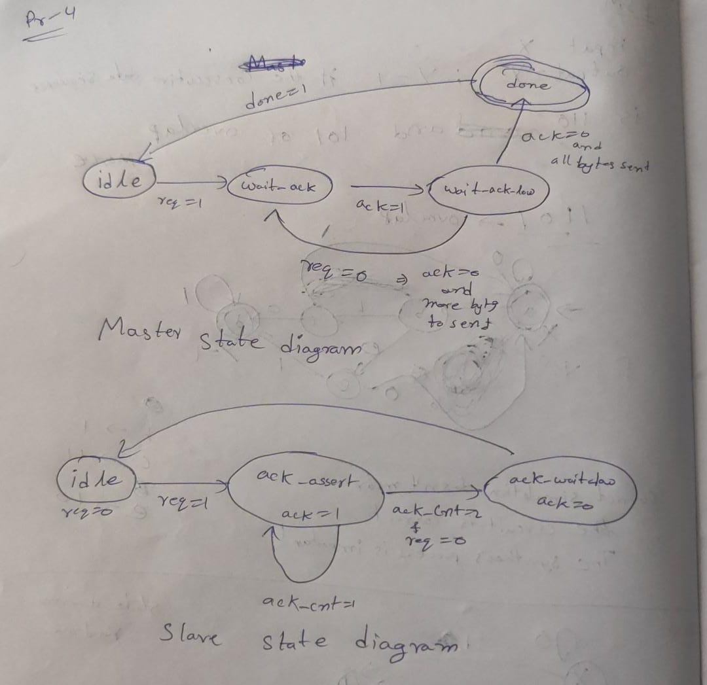
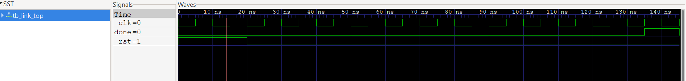

# Problem 4 — 4-Phase Handshake FSM (Master–Slave)

This repository implements a **4-phase request/acknowledge (req/ack) handshake** protocol between a **Master** and **Slave** using Finite State Machines (FSMs).  
The protocol ensures reliable transfer of **4 data bytes** over an 8-bit data bus.

---

## Overview
- Master drives data and raises `req`  
- Slave latches data on `req` and asserts `ack` for 2 cycles  
- Master sees `ack=1` and drops `req`  
- Slave detects `req=0` and drops `ack`  
- Process repeats for **4 bytes**  
- After the final byte, Master asserts `done=1` for one cycle  

---

## System Diagram


---

## FSM States

### Master FSM
- **IDLE (00):** Drives first data byte and asserts `req`  
- **WAIT_ACK (01):** Waits for `ack=1`  
- **WAIT_ACK_LOW (10):** Waits for `ack=0` before next transfer  
- **DONE (11):** Asserts `done=1` for one cycle  

### Slave FSM
- Edge-detection based (monitors `req` rising edge)  
- Latches data into `last_byte`  
- Asserts `ack` for exactly **2 cycles**  
- Drops `ack` after `req` deasserts  

---

## Signal Interface

| Signal      | Width | Direction       | Description |
|-------------|-------|----------------|-------------|
| clk         | 1     | Input          | Common clock |
| rst         | 1     | Input          | Synchronous active-high reset |
| req         | 1     | Master → Slave | Request signal |
| ack         | 1     | Slave → Master | Acknowledge signal |
| data[7:0]   | 8     | Master → Slave | Data bus |
| done        | 1     | Output         | Indicates transfer completion |
| last_byte   | 8     | Internal       | Stores last received byte |

---

## Files
- `link_top.v` — Top-level module connecting Master and Slave  
- `master_fsm.v` — Master FSM implementation  
- `slave_fsm.v` — Slave FSM implementation  
- `tb_link_top.v` — Testbench  

---

## Prerequisites
- **Icarus Verilog** — for compiling and simulating Verilog  
- **GTKWave** — for viewing waveforms  

Install on Ubuntu/Debian:
```bash
sudo apt-get install iverilog gtkwave
```

---

## Run Simulation

```bash
# Compile
iverilog -g2012 -o sim tb_link_top.v link_top.v master_fsm.v slave_fsm.v

# Run
vvp sim

# View waveform
gtkwave dump.vcd
```

---

## Expected Behavior

For memory contents in Master:

```
mem[0] = A0
mem[1] = A1
mem[2] = A2
mem[3] = A3
```

Handshake sequence:
1. Master drives data & raises `req`  
2. Slave latches data & asserts `ack` for 2 cycles  
3. Master drops `req` after seeing `ack`  
4. Slave drops `ack` after `req=0`  
5. Repeats for all 4 bytes  
6. Master asserts `done=1` at the end  

---

## Results

* **4 complete handshakes** observed  
* Each byte (A0, A1, A2, A3) successfully transferred  
* `ack` is asserted for **exactly 2 cycles** per handshake  
* Clean request/ack transitions confirm **protocol compliance**  
* Verified using **GTKWave**  


